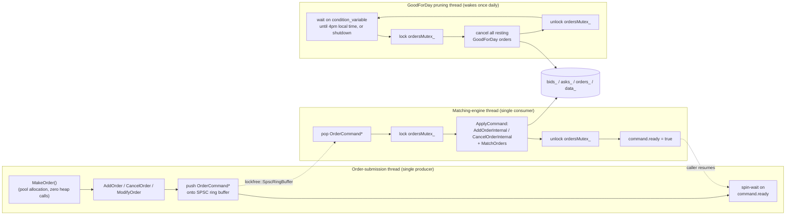

# LimitOrderBook

A C++20 limit order book matching engine implementing price-time priority
matching, modeled on how electronic exchanges match buy and sell orders.
Single-instrument, in-memory, built around a lock-free single-producer/
single-consumer pipeline and a pooled-allocation hot path for predictable
latency.

## Contents

- [Architecture overview](#architecture-overview)
- [Data structure choices](#data-structure-choices)
- [Order type behavior](#order-type-behavior)
- [Performance](#performance)
- [Build instructions](#build-instructions)
- [Known limitations and future work](#known-limitations-and-future-work)

## Architecture overview

An `Orderbook` instance runs three threads with three distinct concurrency
requirements:

- **The order-submission thread** (the caller, exactly one at a time) —
  constructs `Order`s and calls `AddOrder`/`CancelOrder`/`ModifyOrder`.
- **The matching-engine thread** — the *only* thread that ever touches the
  book's core state (`bids_`, `asks_`, `orders_`, `data_`) during normal
  operation.
- **The GoodForDay pruning thread** — sleeps until end-of-day, then wakes
  once to cancel any `GoodForDay` orders still resting.

The order-submission thread never locks a mutex to submit an order. It hands
a command to the matching engine over a lock-free single-producer/single-
consumer ring buffer ([`lockfree::SpscRingBuffer`](https://github.com/RishitaDugar4/lockfree-lib),
a small standalone library published alongside this project) and spin-waits
on a per-command completion flag, so the call still returns the resulting
`Trades` synchronously from the caller's point of view. `ordersMutex_`
still exists, but its only job is serializing the matching-engine thread
against the pruning thread — it is never touched by order submission.



Internally, the book itself is two price-sorted collections plus an index
for O(1) lookup by order ID:

```
asks_  (sorted ascending — best ask = begin())
  101 -> [Order#7, Order#12]
  102 -> [Order#3]
  105 -> [Order#9, Order#1, Order#4]
                                          <- spread ->
bids_  (sorted descending — best bid = begin())
  100 -> [Order#2, Order#8]
   99 -> [Order#5]
   95 -> [Order#6, Order#10]

orders_ (unordered_map<OrderId, OrderEntry>) — O(1) cancel/lookup by ID
  #1 -> { order: Order#1, location: iterator into the list above }
  ...
```

Each price level holds its resting orders in arrival order — that's the
"time" half of price-time priority. Matching always happens against
`bids_.begin()` / `asks_.begin()`.

## Data structure choices

Every non-obvious container choice here was made against a specific
requirement, not by default:

**`bids_` / `asks_` — `absl::btree_map<Price, OrderPointers, Comparator>`**
The book needs price-sorted iteration (best price first), O(log n)
insert/erase, and cheap best/worst-price lookups (`begin()`/`rbegin()`).
`std::map` gives all of that, but its red-black tree nodes are individually
heap-allocated and pointer-chased on every traversal. `absl::btree_map`
gives the same ordered-container guarantees with much better cache
locality (each node holds several elements contiguously) — iterating the
whole book (`GetOrderInfos`) got roughly 2x faster at 5,000 price levels
after this swap. The tradeoff: unlike `std::map`, a btree rebalance can
invalidate references into the *container* on any insert/erase (though not
into values it stores, like the per-level `std::list`). Every place in
`Orderbook.cpp` holding such a reference was audited to make sure it never
survives a later mutation of the same map — documented at the `bids_`/
`asks_` declaration in `Orderbook.h`.

**`orders_` — `std::unordered_map<OrderId, OrderEntry>`**
An order's ID is the only handle a caller has to cancel or modify it, and
that needs to be O(1), not O(log n) — a resting book can hold many
thousands of orders, and "cancel this one" is a hot-path operation, not a
rare one. `OrderEntry` stores both the `shared_ptr<Order>` and the `list`
iterator into its price level's queue, so cancellation never has to scan a
price level to find the order being removed.

**Per-price-level queue — `std::list<OrderPointer>`**
Time priority requires FIFO order within a level, and cancellation requires
O(1) removal from an *arbitrary* position in that queue (the order being
cancelled is rarely at the front). A `std::vector` would need an O(n) shift
on every middle removal; `std::list` gives O(1) removal via a stored
iterator, at the cost of pointer-chasing during matching — an accepted
tradeoff since individual price levels are typically shallow.

**`data_` — `std::unordered_map<Price, LevelData>` (aggregate qty/count per level)**
`FillOrKill` needs to answer "is there enough liquidity to fill this
completely?" *before* touching the book, without walking every resting
order at every candidate level. Aggregate quantity/count counters, updated
incrementally as orders are added/matched/cancelled, let `CanFullyFill`
answer in one pass over *levels*, not *orders*. Bid and ask levels share one
map (keyed only by price) rather than two, which is safe specifically
because a resting book never has a bid price ≥ an ask price — matching
always clears that overlap immediately — so a given price key is only ever
occupied by one side at a time.

**Command queue — `lockfree::SpscRingBuffer<OrderCommand*, 4096>`**
The concurrency shape here is exactly single-producer/single-consumer: one
order-submission thread, one matching-engine thread. A general MPMC queue
would need CAS loops and be harder to reason about for no benefit; a fixed-
capacity SPSC ring buffer synchronized with plain acquire/release atomics
is simpler to prove correct (validated with a 2M-element concurrent
stress test under ThreadSanitizer in the `lockfree-lib` repo) and faster.
The queue carries a **pointer** to a stack-allocated `OrderCommand`, not the
command by value — `OrderCommand` contains a `std::atomic<bool>` completion
flag, which isn't movable, and queuing a value would mean either the queue
element type couldn't hold that flag or the command would need to live on
the heap. A pointer avoids both: the command lives on the submitting
thread's stack for the duration of the call, and the queue only ever moves
an 8-byte pointer.

**Order memory pool — `OrderMemoryPool` + `OrderPoolAllocator` + `std::allocate_shared`**
Every `std::make_shared<Order>` is a heap allocation with unpredictable
latency (allocator-internal locking, page faults, fragmentation) sitting
directly on the order-submission hot path. `OrderMemoryPool` pre-allocates
a fixed number of fixed-size blocks; `OrderPoolAllocator` adapts it to the
standard Allocator interface so `std::allocate_shared<Order>` constructs
the `Order` object *and* its `shared_ptr` control block together in a
single pooled block — zero heap allocator calls per order, verified in
`tests/OrderMemoryPoolTests.cpp` by literally intercepting `operator new`/
`operator delete` and asserting the call count doesn't move. The free list
is mutex-protected rather than lock-free: allocation only ever happens on
the order-submission thread, but *deallocation* can happen from either the
matching-engine thread (the common case, on every fill/cancel) or the
pruning thread (cancelling a `GoodForDay` order at end of day) — a genuine
multi-producer/single-consumer shape, where a rarely-contended mutex around
a pointer-only free list is both simpler and still far cheaper than the
heap allocation it replaces.

## Order type behavior

| Type | Rests in book? | Behavior |
|---|---|---|
| `GoodTillCancel` (GTC) | Yes | Matches whatever it can immediately; any unfilled remainder rests indefinitely until explicitly cancelled or fully filled. |
| `FillAndKill` (FAK / industry: IOC) | No | Matches whatever liquidity is immediately available; any unfilled remainder is cancelled rather than resting. If the order can't cross *at all*, it's rejected outright (zero trades, nothing added). |
| `FillOrKill` (FOK) | No | All-or-nothing. Aggregate liquidity across price levels is checked *before* any matching happens; if it can't be fully filled, the order is rejected with zero trades and the book is left untouched. |
| `GoodForDay` (GFD) | Yes | Identical matching/resting behavior to GTC, but tagged for automatic cancellation by the pruning thread at end of day (hardcoded to 4pm local system time). |
| `Market` | Depends | No limit price. Internally converted to an aggressively-priced GTC order at the current worst resting price on the opposite side, then matched normally — it sweeps as much resting liquidity as exists. Rejected if the opposite side of the book is empty (there's no price to reference). |

All matching goes through one function (`Orderbook::MatchOrders`): while the
best bid ≥ the best ask, the front orders on each side trade for
`min(remaining quantities)`; whichever side is fully filled leaves its
queue; repeat. `AddOrder`/`ModifyOrder` return the resulting `Trades`
(possibly empty); `ModifyOrder` is implemented as cancel-then-re-add under
the same order ID, preserving the original order type; `CancelOrder` is a
no-op if the ID isn't currently resting.

## Performance

Measured with the included Google Benchmark suite (`orderbook_bench`) on
Apple M4 / macOS, Release build, median of 3 runs at
`--benchmark_min_time=0.5s`:

| Benchmark | Time | What it measures |
|---|---:|---|
| `BM_AddOrder_NoMatch` | ~1.73 µs | Submit a new resting order, no crossing |
| `BM_AddOrder_WithMatch` | ~2.10 µs | Submit an order that immediately fully matches |
| `BM_CancelOrder` | ~1.54 µs | Cancel a resting order (book depth ~10k) |
| `BM_ModifyOrder` | ~2.32 µs | Cancel + re-add under the same ID (book depth ~10k) |
| `BM_GetOrderInfos` (10 levels) | ~199 ns | Snapshot the book's price levels |
| `BM_GetOrderInfos` (100 levels) | ~1.04 µs | ” |
| `BM_GetOrderInfos` (1,000 levels) | ~10.2 µs | ” |
| `BM_GetOrderInfos` (5,000 levels) | ~48.9 µs | ” |

**Methodology note:** the `AddOrder`/`CancelOrder`/`ModifyOrder` numbers are
full round-trip latency as a single caller sees it — push onto the SPSC
queue, cross to the matching-engine thread, process, cross back — not
matching-logic-only cost. That handoff is the dominant cost in all four,
and it's inherent to the architecture: a single sequential caller pays a
real cross-thread synchronization cost that a direct, uncontended
mutex-locked call wouldn't. What this design buys instead is immunity from
multi-threaded lock contention — see [Known limitations](#known-limitations-and-future-work)
for the caveat on what "multi-threaded" can mean here.

Reproduce with:
```sh
./build/orderbook_bench --benchmark_min_time=0.5s --benchmark_repetitions=3 --benchmark_report_aggregates_only=true
```

## Build instructions

**Requirements:** CMake ≥ 3.16, a C++20 compiler (developed against
AppleClang on macOS; no platform-specific code beyond `localtime_r`, so any
POSIX-ish libc++/libstdc++ target should work).

**Dependencies:** Abseil, Google Benchmark, Catch2, and
[`lockfree-lib`](https://github.com/RishitaDugar4/lockfree-lib) (the SPSC
ring buffer, published alongside this project) are all fetched
automatically via CMake `FetchContent` — no manual setup needed.

```sh
cmake -S . -B build -DCMAKE_BUILD_TYPE=Release
cmake --build build -j
```

Run the test suite:
```sh
ctest --test-dir build          # or: ./build/orderbook_tests
```

Run the benchmarks:
```sh
./build/orderbook_bench
```

**CMake options** (both default `ON`):
- `LOB_BUILD_TESTS` — build the Catch2 suite (`orderbook_tests`)
- `LOB_BUILD_BENCHMARKS` — build the Google Benchmark suite (`orderbook_bench`)

`main.cpp` / the `limit_order_book` executable is currently a minimal
scaffold (constructs and immediately destroys an `Orderbook`), not a demo —
see the test suite for realistic usage examples of every order type.

## Known limitations and future work

- **Single-producer only.** `AddOrder`/`CancelOrder`/`ModifyOrder`/
  `MakeOrder` may only be called from one thread over the `Orderbook`'s
  lifetime — the SPSC ring buffer is undefined behavior with more than one
  producer. A real multi-client venue needs multi-producer ingestion (MPSC,
  or per-client SPSC queues fanned into the engine) — this is the main
  reason the lock-free redesign doesn't reduce *contention* today: with
  only one producer, there was never much contention on the old mutex to
  relieve in the first place.
- **No self-trade prevention or participant identity.** `OrderId` is just a
  caller-assigned number with same-book-duplicate detection; there's no
  concept of "owner," so nothing stops two orders from the same real-world
  participant matching against each other.
- **No market data / trade publication.** Trades are only ever returned
  synchronously to the submitting call — there's no fan-out to external
  subscribers, which is a core function of a real exchange.
- **No persistence.** Book state is in-memory only and is lost on process
  exit; no write-ahead log, no crash recovery.
- **No risk checks** — no position limits, fat-finger checks, or price
  collars.
- **Hardcoded GFD pruning time.** End-of-day cancellation fires at 4pm
  *local system time*, unconditionally — no trading calendar, holidays, or
  configurable session times.
- **Fixed-capacity resources fail closed, by design.** The order pool
  (default 100,000 orders, configurable per `Orderbook`) and the SPSC
  command queue (4,096 slots) don't grow — exhausting either throws /
  backpressures rather than silently falling back to the heap. Sizing them
  for expected order flow is the caller's responsibility.
- **Single instrument per `Orderbook`.** No cross-instrument matching, no
  portfolio-level state.
- **A known ThreadSanitizer-only flake** in one pruning-thread regression
  test (`OrderbookPruningTests.cpp`) — a documented macOS libc++/pthread
  condition-variable quirk under heavy thread-creation churn, not a real
  data race (TSan itself never reports a race there, and the scenario is
  solid across 25+ consecutive runs outside of TSan).

**Natural next steps**, roughly in order of impact: MPSC order ingestion
(the change that would actually make the lock-free architecture pay off
under real concurrent load); a trade/market-data output queue; a
write-ahead log for crash recovery; self-trade prevention; and configurable
trading sessions.
